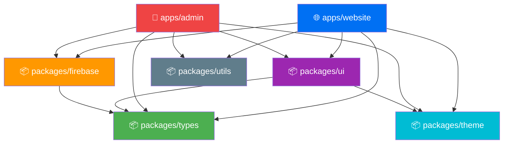

<div align="center">

# 🦷 Dr. Amir's Dental Clinic

### Modern Full-Stack Clinic Management Platform

[](https://nextjs.org/)
[](https://react.dev/)
[](https://www.typescriptlang.org/)
[](https://tailwindcss.com/)
[](https://firebase.google.com/)
[](https://turbo.build/)
[](https://pnpm.io/)
[](https://www.framer.com/motion/)

<br/>

A premium, full-stack monorepo consisting of a **highly animated patient-facing website** and an **authenticated admin dashboard** for managing clinic operations, appointments, reviews, services, and blog content — all in real-time.

---

**[🌐 Live Website](#) · [🔐 Admin Panel](#) · [📖 Documentation](#-table-of-contents)**

</div>

---

## 📑 Table of Contents

- [✨ Features](#-features)
- [🛠️ Tech Stack](#️-tech-stack)
- [📂 Project Architecture](#-project-architecture)
- [⚡ Quick Start](#-quick-start)
- [🔧 Environment Variables](#-environment-variables)
- [🔥 Firebase Setup](#-firebase-setup)
- [☁️ Cloudinary Setup](#️-cloudinary-setup)
- [📜 Available Scripts](#-available-scripts)
- [🚀 Deployment](#-deployment)
- [✅ Pre-Launch Checklist](#-pre-launch-checklist)
- [📄 License](#-license)

---

## ✨ Features

<table>
<tr>
<td width="50%">

### 🌐 Patient Website
- 🎬 Cinematic landing with glassmorphism & scroll animations
- 📅 Dynamic appointment booking with real-time slot management
- 🏥 Live clinic status (Open / Closed / Emergency)
- 🦷 Interactive service catalog with before/after galleries
- 📝 Blog section with rich content rendering
- ⭐ Patient reviews with star ratings
- 👨‍⚕️ Doctor profile with credentials & gallery
- 📱 Fully responsive — mobile, tablet, desktop
- 🌙 Dark mode support

</td>
<td width="50%">

### 🔐 Admin Dashboard
- 🔒 JWT-authenticated secure login (`jose`)
- 📊 Overview dashboard with analytics
- 🗓️ Appointment management (accept, reject, verify payments)
- 💰 Cash & online payment verification flows
- ✍️ TipTap rich-text blog editor (Bold, Italic, Links, Images)
- 🦷 Services CRUD with before/after image uploads
- 💬 Patient message inbox
- ⭐ Review moderation with admin replies
- ⏰ Clinic status & working hours control
- 🕐 Dynamic appointment slot & day management
- 📸 Cloudinary-powered image uploads
- 🔄 Real-time Firestore sync (`onSnapshot`)

</td>
</tr>
</table>

---

## 🛠️ Tech Stack

### Core Framework & Language

| Technology | Version | Purpose |
|:---:|:---:|:---|
|  **Next.js** | `14.1` | React meta-framework with App Router, SSR & API routes |
|  **React** | `18.2` | Component-based UI library |
|  **TypeScript** | `5.3` | Static typing for safe, scalable code |
|  **Turborepo** | `2.3` | High-performance monorepo build system |
|  **pnpm** | `9.15` | Fast, disk-efficient package manager |

### Frontend & UI

| Technology | Version | Purpose |
|:---:|:---:|:---|
|  **Tailwind CSS** | `3.4` | Utility-first CSS framework |
|  **Framer Motion** | `11.0` | Production-ready animations & transitions |
|  **Lucide React** | `0.344` | Beautiful, consistent icon library |
| **Sonner** | `1.4` | Elegant toast notifications |
| **React Day Picker** | `8.10` | Accessible date picker component |

### State Management & Forms

| Technology | Version | Purpose |
|:---:|:---:|:---|
| **Zustand** | `4.5` | Lightweight, flexible global state |
| **React Hook Form** | `7.50` | Performant form handling with minimal re-renders |
|  **Zod** | `3.22` | TypeScript-first schema validation |
| **@hookform/resolvers** | `3.3` | Bridges Zod schemas with React Hook Form |

### Backend & Database

| Technology | Version | Purpose |
|:---:|:---:|:---|
|  **Firebase Firestore** | Latest | NoSQL realtime document database |
|  **Firebase Storage** | Latest | File/image cloud storage |
|  **Cloudinary** | Latest | Optimized image hosting, transformation & CDN delivery |
| **Jose** | `5.2` | JWT token signing & verification for admin auth |

### Admin-Specific

| Technology | Version | Purpose |
|:---:|:---:|:---|
| **TipTap** | `2.2` | Headless, extensible rich-text editor for blog posts |
| **Recharts** | `2.12` | Composable charting library for dashboard analytics |
| **TanStack Table** | `8.13` | Headless, powerful data table for appointments & reviews |

---

## 📂 Project Architecture

This project uses a **pnpm workspace monorepo** powered by **Turborepo** for parallel builds, intelligent caching, and shared packages.

```
dr-amir-dental/
│
├── 📱 apps/
│   ├── website/                 # Patient-facing Next.js app (port 3000)
│   │   ├── app/                 # Next.js App Router pages
│   │   ├── components/
│   │   │   ├── layout/          # Header, Footer, Navigation
│   │   │   └── sections/        # Hero, Services, About, Reviews, Blog, Appointments
│   │   ├── hooks/               # Custom hooks (useClinicStatus, useServices, etc.)
│   │   └── stores/              # Zustand stores (useBookingStore)
│   │
│   └── admin/                   # Admin dashboard Next.js app (port 3001)
│       ├── app/
│       │   ├── login/           # JWT authentication page
│       │   └── dashboard/       # Protected admin routes
│       │       ├── appointments/  # Appointment management + Booking Settings
│       │       ├── services/      # Service CRUD with image uploads
│       │       ├── blog/          # Blog management with TipTap editor
│       │       ├── reviews/       # Review moderation
│       │       ├── messages/      # Patient message inbox
│       │       ├── about/         # Doctor & Clinic profile management
│       │       ├── clinic-status/ # Working hours & emergency controls
│       │       └── settings/      # System configuration
│       └── components/
│           ├── layout/          # AdminSidebar, AdminHeader
│           └── ui/              # TipTapEditor, custom admin components
│
├── 📦 packages/                 # Shared code across both apps
│   ├── firebase/                # Firebase init, Firestore CRUD helpers
│   ├── theme/                   # Global CSS variables, Tailwind config, fonts
│   ├── types/                   # Shared TypeScript interfaces & types
│   ├── ui/                      # Reusable React components (Button, Card, Modal, Badge, Input)
│   └── utils/                   # Helper functions (date formatting, slugs)
│
├── 📄 .env.example              # Environment variable template
├── 📄 package.json              # Root workspace configuration
├── 📄 pnpm-workspace.yaml       # pnpm workspace definition
└── 📄 turbo.json                # Turborepo pipeline configuration
```

### Package Dependency Graph



---

## ⚡ Quick Start

### Prerequisites

Ensure you have the following installed:

| Tool | Version | Install |
|:---:|:---:|:---|
|  **Node.js** | `>= 20.x` | [Download](https://nodejs.org/) |
|  **pnpm** | `>= 9.x` | `npm install -g pnpm` |
|  **Git** | Latest | [Download](https://git-scm.com/) |

### Installation

**1. Clone the repository**

```bash
git clone https://github.com/your-username/Amir-s-Clinic.git
cd Amir-s-Clinic/dr-amir-dental
```

**2. Install all dependencies**

> pnpm automatically resolves all workspace packages in one command.

```bash
pnpm install
```

**3. Set up environment variables**

```bash
# Copy the environment template
cp .env.example .env.local

# Copy to each app directory (required for Next.js)
cp .env.local apps/website/.env.local
cp .env.local apps/admin/.env.local
```

> ⚠️ **Important:** Edit each `.env.local` file with your actual Firebase & Cloudinary credentials. See the [Environment Variables](#-environment-variables) section below.

**4. Start the development servers**

```bash
pnpm dev
```

> Turborepo will spin up both apps concurrently with hot reloading.

**5. Open in your browser**

| App | URL | Description |
|:---|:---|:---|
| 🌐 **Website** | [http://localhost:3000](http://localhost:3000) | Patient-facing website |
| 🔐 **Admin** | [http://localhost:3001](http://localhost:3001) | Admin dashboard (login required) |

---

## 🔧 Environment Variables

Create a `.env.local` file in the root directory and in each app directory with the following variables:

```env
# ══════════════════════════════════════════════
# 🔥 Firebase Configuration
# ══════════════════════════════════════════════
NEXT_PUBLIC_FIREBASE_API_KEY="your_api_key"
NEXT_PUBLIC_FIREBASE_AUTH_DOMAIN="your-project.firebaseapp.com"
NEXT_PUBLIC_FIREBASE_PROJECT_ID="your-project-id"
NEXT_PUBLIC_FIREBASE_STORAGE_BUCKET="your-project.appspot.com"
NEXT_PUBLIC_FIREBASE_MESSAGING_SENDER_ID="your_sender_id"
NEXT_PUBLIC_FIREBASE_APP_ID="your_app_id"

# ══════════════════════════════════════════════
# 🔐 Admin Authentication (JWT)
# ══════════════════════════════════════════════
ADMIN_EMAIL="admin@amirclinic.com"
ADMIN_PASSWORD="your-secure-password"
JWT_SECRET="generate-a-random-32-character-secret-key"

# ══════════════════════════════════════════════
# ☁️ Cloudinary (Image Uploads)
# ══════════════════════════════════════════════
NEXT_PUBLIC_CLOUDINARY_CLOUD_NAME="your_cloud_name"
CLOUDINARY_API_KEY="your_api_key"
CLOUDINARY_API_SECRET="your_api_secret"

# ══════════════════════════════════════════════
# 🌐 Application URLs
# ══════════════════════════════════════════════
NEXT_PUBLIC_WEBSITE_URL="http://localhost:3000"
NEXT_PUBLIC_ADMIN_URL="http://localhost:3001"
```

> 💡 **Tip:** Generate a strong JWT secret using:
> ```bash
> node -e "console.log(require('crypto').randomBytes(32).toString('hex'))"
> ```

---

## 🔥 Firebase Setup

1. Go to [Firebase Console](https://console.firebase.google.com/) → **Create a new project**
2. Click the **Web App** icon (`</>`) → Register your app → Copy config values to `.env.local`
3. Enable **Firestore Database:**
   - Navigate to **Build → Firestore Database**
   - Create in **test mode** (configure strict rules for production)
4. Enable **Storage:**
   - Navigate to **Build → Storage** → Initialize

### Firestore Collections (auto-created)

| Collection | Purpose |
|:---|:---|
| `clinicConfig` | Clinic info, working hours, social links, appointment slots |
| `services` | Dental services with before/after images |
| `appointments` | Patient bookings with payment status |
| `reviews` | Patient reviews with admin replies |
| `blogPosts` | Blog articles with TipTap HTML content |
| `messages` | Contact form submissions |

### Recommended Security Rules (Production)

```javascript
rules_version = '2';
service cloud.firestore {
  match /databases/{database}/documents {
    // Public read access for website content
    match /clinicConfig/{doc} { allow read: if true; }
    match /services/{doc}     { allow read: if true; }
    match /blogPosts/{doc}    { allow read: if true; }
    match /reviews/{doc}      { allow read: if true; }
    
    // Write access requires authentication
    match /{document=**} {
      allow write: if request.auth != null;
    }
    
    // Anyone can create appointments, messages, and reviews
    match /appointments/{doc} { allow create: if true; }
    match /messages/{doc}     { allow create: if true; }
    match /reviews/{doc}      { allow create: if true; }
  }
}
```

---

## ☁️ Cloudinary Setup

1. Sign up at [Cloudinary](https://cloudinary.com/) (free tier available)
2. Go to **Dashboard** → Copy your **Cloud Name**, **API Key**, and **API Secret**
3. Paste them into your `.env.local` file

> Cloudinary is used for optimized image hosting with automatic format conversion, responsive sizing, and CDN delivery.

---

## 📜 Available Scripts

Run these commands from the **root** directory (`dr-amir-dental/`):

| Command | Description |
|:---|:---|
| `pnpm dev` | Start all apps in development mode with hot reload |
| `pnpm build` | Build all apps and packages for production |
| `pnpm lint` | Run ESLint across all workspaces |
| `pnpm type-check` | Run TypeScript type checking |
| `pnpm clean` | Remove all `.next` build artifacts |

### Run Individual Apps

```bash
# Website only
pnpm --filter @dental/website dev

# Admin only
pnpm --filter @dental/admin dev
```

---

## 🚀 Deployment

### Vercel (Recommended)

Both apps can be deployed on **Vercel** as separate projects:

**Website Deployment:**
```bash
# In Vercel dashboard:
# Root Directory: dr-amir-dental/apps/website
# Build Command: cd ../.. && pnpm build --filter=@dental/website
# Install Command: pnpm install
```

**Admin Deployment:**
```bash
# In Vercel dashboard:
# Root Directory: dr-amir-dental/apps/admin
# Build Command: cd ../.. && pnpm build --filter=@dental/admin
# Install Command: pnpm install
```

> Don't forget to add all environment variables in your Vercel project settings!

---

## ✅ Pre-Launch Checklist

Before going live, verify the following:

- [ ] **Database Connection** — Website loads without Firebase errors
- [ ] **Admin Login** — Can authenticate at `/login` with configured credentials
- [ ] **Real-time Sync** — Adding a service in admin instantly appears on the website
- [ ] **Image Uploads** — Profile pictures and blog thumbnails upload to Cloudinary
- [ ] **Appointment Flow** — Full booking cycle works (date → time → details → payment → confirmation)
- [ ] **Payment Methods** — Both online (screenshot) and cash payment flows work
- [ ] **Blog Editor** — TipTap editor creates formatted content that renders correctly on the website
- [ ] **Mobile Responsive** — All pages display properly on mobile devices
- [ ] **Security** — `.env.local` files are **NOT** tracked by Git
- [ ] **Clinic Status** — Emergency closure toggle works and banner shows on website

---

<div align="center">

### 🏗️ Built With

<p>

&nbsp;&nbsp;

&nbsp;&nbsp;

&nbsp;&nbsp;

&nbsp;&nbsp;

&nbsp;&nbsp;

&nbsp;&nbsp;

&nbsp;&nbsp;

&nbsp;&nbsp;

</p>

---

Made with ❤️ by **Shumaila Mustafa** for **Dr. Aamir's Dental Clinic**

</div>
